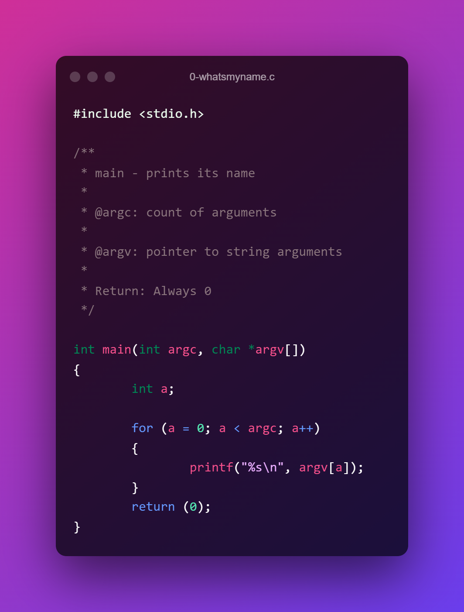

# Description

A directory for task dealing with arguments to the main function which are argc and argv[]

## Format

```c
#include <stdio.h>

int main(int argc, char *argv[])
{
	return (0);
}
```

